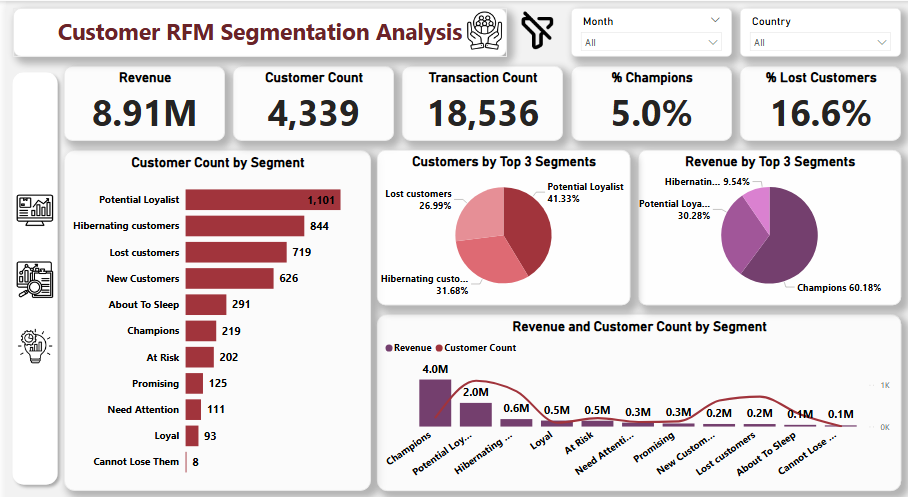
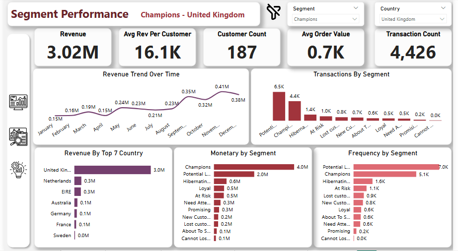
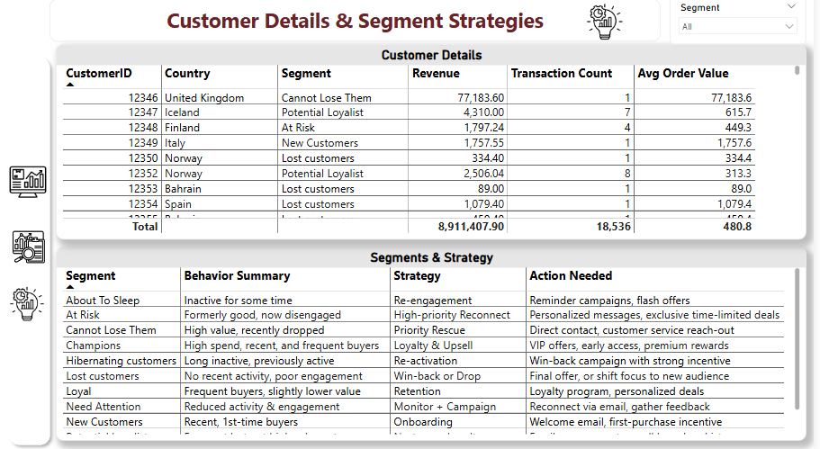

# 🧠 Customer RFM Segmentation Analysis

## 📌 Objective
The goal of this project is to analyze customer behavior using RFM (Recency, Frequency, Monetary) segmentation. The dashboard helps identify key customer groups such as VIPs, Lost Customers, and Potential Loyalists to support targeted retention and marketing strategies.

---

## 📊 Tools Used
- Microsoft Excel (for initial data prep and RFM scoring)
- Power BI (for interactive dashboards)
- DAX (for calculations and segmentation logic)

---

## 📁 Files Included
- `Online_Retail_dataset.xlsx`: Cleaned transactional data  
- `Customer_RFM_Segmentation_dashboard.pbix`: Power BI dashboard  
- `1_RFM Segmentation Analysis.PNG`: Overview of customer segmentation  
- `2_Segment Performance.PNG`: Deep dive into a selected segment  
- `3_Customer Details & Segment Strategies.PNG`: Detailed strategies and customer-level view

---

## 🧠 Key Insights
- **41.3%** of customers are *Potential Loyalists*  
- **60.18%** of revenue comes from *Champions*  
- Lost customers make up **16.6%** of all customers  
- The UK is the top revenue-generating country for the *Champions* segment  
- Segment-specific strategies are outlined to guide retention and re-engagement efforts

---

## 📷 Dashboard Snapshots

### 🔸 Page 1 – RFM Segmentation Overview

---

### 🔸 Page 2 – Segment Performance (with filters)

---

### 🔸 Page 3 – Customer Details & Segment Strategies

---

## 🧩 What I Learned
- How to implement percentile-based RFM scoring in Excel  
- How to design multi-page dashboards in Power BI  
- Using DAX for dynamic segmentation, KPI calculations, and slicer interactivity  
- Translating raw data into real business strategies

---

## 💬 Contact
If you're a recruiter or data enthusiast, feel free to connect with me!  
📧 Email: `mostafahafezfouad@gmail.com 
🔗 LinkedIn: `www.linkedin.com/in/mostafa-hafez-115b11241

